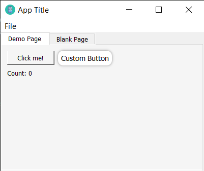

# PyQt5-app-template
Improve code readability, modularity and separation between frontend and backend 

<p align="left">
  
</p>

## Create New Pages this way
```python
from PyQt5.QtWidgets import QLabel, QPushButton
from frontend.pages.BaseClassPage import BaseClassPage

class DemoPage(BaseClassPage):                             # Must inherit from BaseClassPage
    title = "Demo Page"                                    # Must define a title

    def initUI(self, layout):                              # Must define the initUT method
        # Add a QPushButton
        button = QPushButton("Click me!")
        button.clicked.connect(self.on_button_click)

        # Add a label
        self.label = QLabel("Count: 0")

        # Set layout
        layout.addWidget(button)
        layout.addWidget(self.label)

    def on_button_click(self):
        print("Button clicked")
        self.model.increment_count()                        # access to Model methods
        self.label.setText(f"Count: {self.model.count}")    # access to Model attributes
```

## And define your Model attributes and methods this way
`backend\MainModel.py`
```python

class MainModel:
    # Model attributes
    count = 0

    def __init__(self) -> None:
        pass

    # Model methods
    def increment_count(self):
        self.count += 1
```

## Then add your page to the MainWindow
```python
# main.py
import sys
from PyQt5.QtWidgets import QApplication

from backend.MainModel import MainModel
from frontend.MainWindow import *
from frontend.pages.DemoPage import DemoPage

if __name__ == '__main__':
    app = QApplication(sys.argv)

    mainModel = MainModel()                                              # create a Data Model

    pages = [
        DemoPage(),                                                      # Add pages
    ]
    ex = MainWindow(pages=pages, model=mainModel, title="App Title")     # Create MainWindow

    sys.exit(app.exec_())
```
